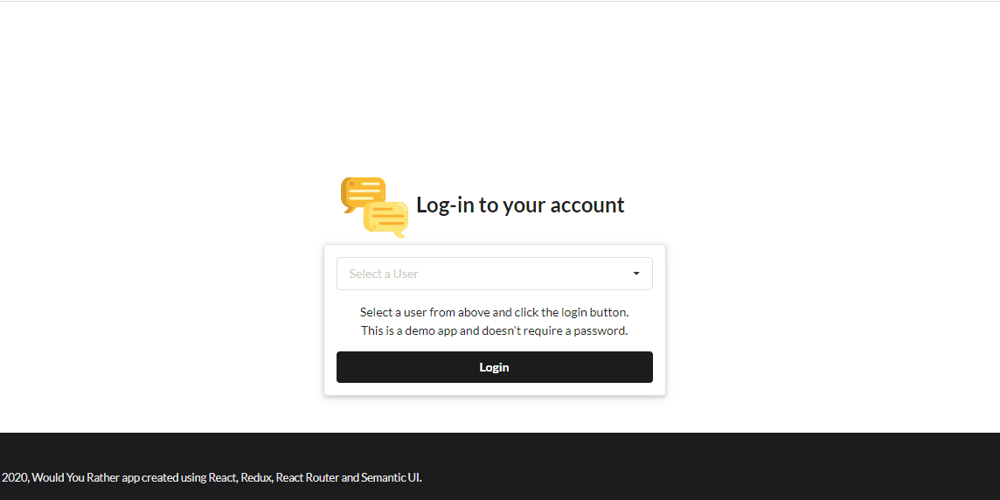

<h1 align="center">
  
</h1>

<h1>
  
</h1>

This project was bootstrapped with [Create React App](https://github.com/facebook/create-react-app).

## 📝Description

<p><strong>Would You Rather</strong> is the second project of <strong>Udacity School's React Nanodegree Program</strong> course, and its aims is to build a web app that lets a user play the "Would You Rather?" game. The game goes like this: A user is asked a question in the form: "Would you rather [option A] or [option B]?". Answering "neither" or "both" is against the rules.
</p>

<p>
In the app, users will be able to answer questions, see which questions they haven't answered, see how other people have voted, post questions, and see the ranking of users on the leaderboard.
</p>

---

## 💻Used Technologies

- [ReactJS](https://pt-br.reactjs.org/)
- [Redux](https://redux.js.org/)
- [React Router](https://reacttraining.com/react-router/web/guides/quick-start)
- [Semantic UI](https://react.semantic-ui.com/)

---

## 📁Download

```bash

# Clone the repository
$ git clone https://github.com/jose-renato-m/reactnd-pwyr

# Enter into the directory
$ cd reactnd-pwyr

# Install dependencies
$ npm install

# Run the project
$ npm start

```

---

Made with 💙 by José Renato Montagnana 👋🏻 [Get in touch!](https://www.linkedin.com/in/joserenato-devfullstack/)
